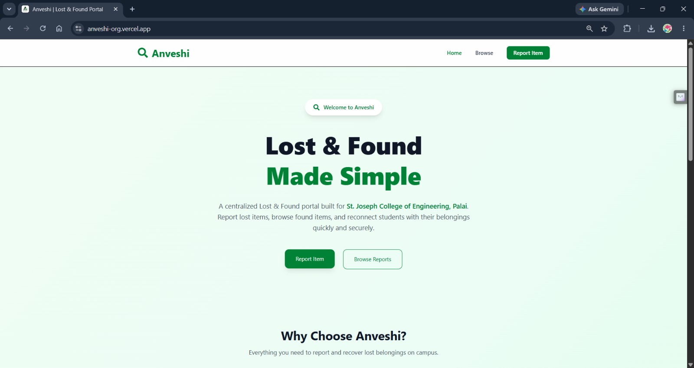
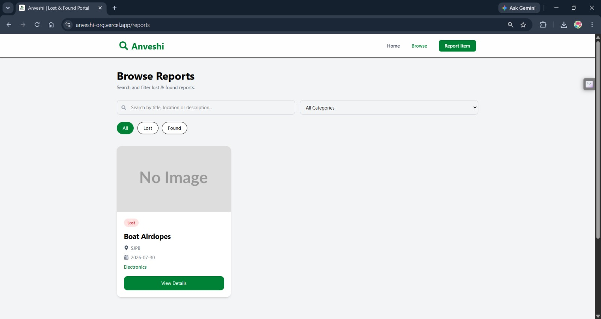
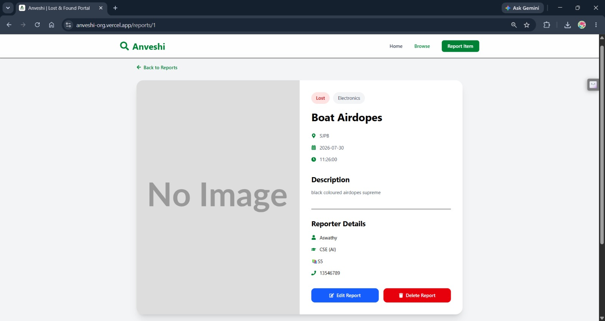
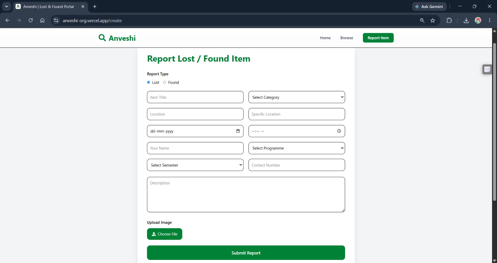
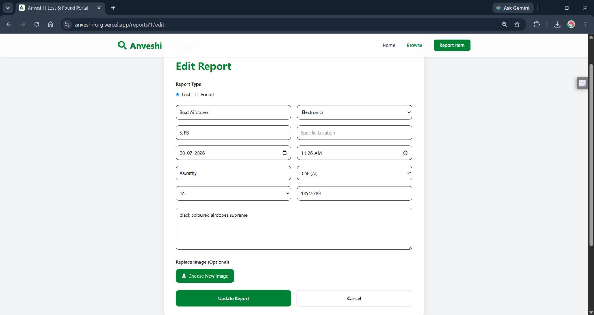

<div align="center">

# 🔍 Anveshi

### Smart Lost & Found Portal for College Campuses

<p align="center">
A modern full-stack web application that helps students report, discover, and recover lost belongings through a clean, fast, and intuitive interface.
</p>

<p align="center">


</p>

<p align="center">


</p>

<p align="center">

🌐 <a href="https://anveshi-org.vercel.app"><strong>Live Demo</strong></a> •
🚀 <a href="https://anveshi-backend.onrender.com/docs"><strong>API Docs</strong></a>

</p>

---

</div>

# 📖 About

Every semester, hundreds of valuable belongings such as phones, ID cards, wallets, laptops, keys, and accessories are misplaced across college campuses.

Most institutions rely on WhatsApp groups, paper notices, or word of mouth, making it difficult for owners to recover their belongings efficiently.

**Anveshi** digitizes the entire lost-and-found workflow by providing a centralized platform where users can:

- Report lost items
- Report found items
- Upload item images
- Search existing reports
- Filter by category
- Edit and manage reports
- Recover belongings faster

---

# ✨ Features

## 🔍 Smart Search

Instantly search reports by

- Title
- Location
- Description

---

## 📂 Category Filtering

Filter reports based on categories like

- Electronics
- Accessories
- Documents
- Stationery
- Others

---

## 📷 Image Upload

Attach an image while reporting an item.

Supports previewing uploaded images.

---

## 📍 Detailed Location Tracking

Store

- Main Location
- Specific Location

to help identify exactly where an item was found or lost.

---

## 📝 Report Management

Users can

- Create Reports
- View Reports
- Update Reports
- Delete Reports

---

## 🎨 Responsive UI

Designed for

- Desktop
- Laptop
- Tablet
- Mobile

---

# 📸 Screenshots

| Home | Browse |
|------|---------|
|  |  |

| Report Details | Create Report |
|----------------|---------------|
|  |  |

| Edit Report |
|-------------|
|  |

---

# 🏗 Architecture

```
                    React + Vite
                          │
                          │
                      Axios API
                          │
                          │
                     FastAPI Server
                          │
                 SQLAlchemy ORM
                          │
                       SQLite
```

---

# 🛠 Tech Stack

## Frontend

- React.js
- Vite
- Tailwind CSS
- React Router DOM
- Axios
- React Icons
- React Hot Toast

---

## Backend

- FastAPI
- SQLAlchemy
- Pydantic
- Python Multipart
- Uvicorn

---

## Database

- SQLite

---

## Deployment

Frontend

- Vercel

Backend

- Render

---

# 📂 Project Structure

```
Anveshi
│
├── backend
│   ├── routes
│   ├── uploads
│   ├── app.py
│   ├── crud.py
│   ├── database.py
│   ├── models.py
│   ├── schemas.py
│   └── requirements.txt
│
├── frontend
│   ├── public
│   ├── src
│   ├── package.json
│   ├── vite.config.js
│   └── .env
│
│
└── README.md
```

---

# 🚀 Getting Started

## Clone Repository

```bash
git clone https://github.com/Aswathy486/Anveshi.git
```

```
cd Anveshi
```

---

## Backend Setup

```bash
cd backend
```

Create virtual environment

```bash
python -m venv venv
```

Activate

Windows

```bash
venv\Scripts\activate
```

Install dependencies

```bash
pip install -r requirements.txt
```

Run server

```bash
uvicorn app:app --reload
```

Backend

```
http://127.0.0.1:8000
```

---

## Frontend Setup

```bash
cd frontend
```

Install packages

```bash
npm install
```

Create `.env`

```env
VITE_API_URL=http://127.0.0.1:8000
```

Run

```bash
npm run dev
```

Frontend

```
http://localhost:5173
```

---

# 🌐 API Endpoints

| Method | Endpoint | Description |
|---------|----------|-------------|
| GET | `/reports` | Get all reports |
| GET | `/reports/{id}` | Get report by ID |
| POST | `/reports` | Create report |
| PUT | `/reports/{id}` | Update report |
| DELETE | `/reports/{id}` | Delete report |

---

# 🚀 Deployment

Frontend

**Vercel**

Backend

**Render**

---

# 🛣 Roadmap

- ✅ Report Lost Items
- ✅ Report Found Items
- ✅ Search Reports
- ✅ Category Filters
- ✅ Image Upload
- ✅ CRUD Operations
- ✅ Production Deployment

### Planned Features

- ⬜ User Authentication
- ⬜ AI Image Matching
- ⬜ Email Notifications
- ⬜ Google Maps Integration
- ⬜ Cloud Storage
- ⬜ Admin Dashboard
- ⬜ Chat Support
- ⬜ QR-based Lost Item Recovery

---

# 🤝 Contributing

Contributions are welcome.

1. Fork the repository.

2. Create a feature branch.

3. Commit your changes.

4. Push to your branch.

5. Open a Pull Request.

---

# 👩‍💻 Developer

**Aswathy Santhosh**

🔗 GitHub

https://github.com/Aswathy486

🔗 LinkedIn

https://www.linkedin.com/in/aswathy-santhosh-9932a5328

---

# ⭐ Support

If you found this project useful,

please consider giving it a ⭐ on GitHub.

It helps others discover the project and supports future development.

---

<div align="center">

Made with ❤️ using React, FastAPI and Python

</div>
